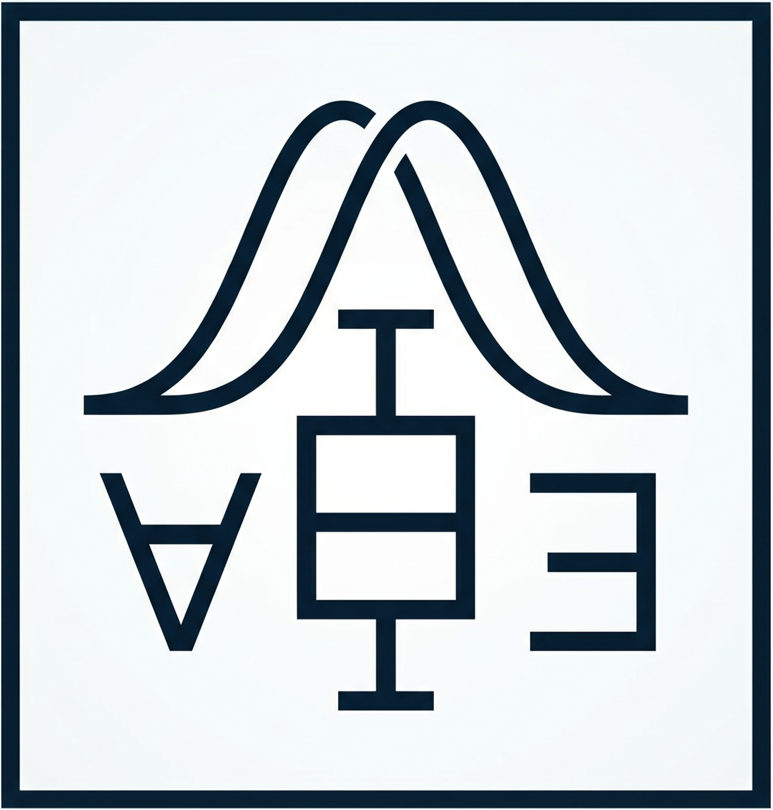
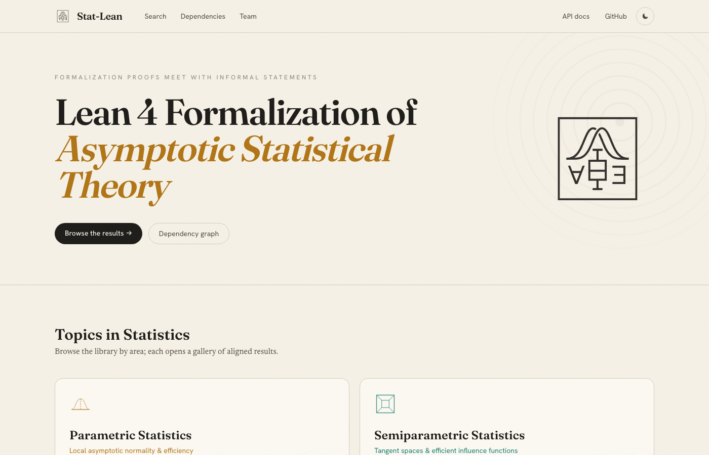
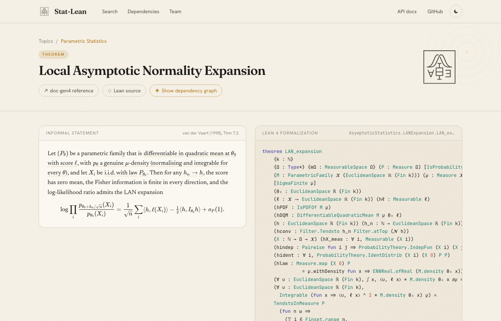
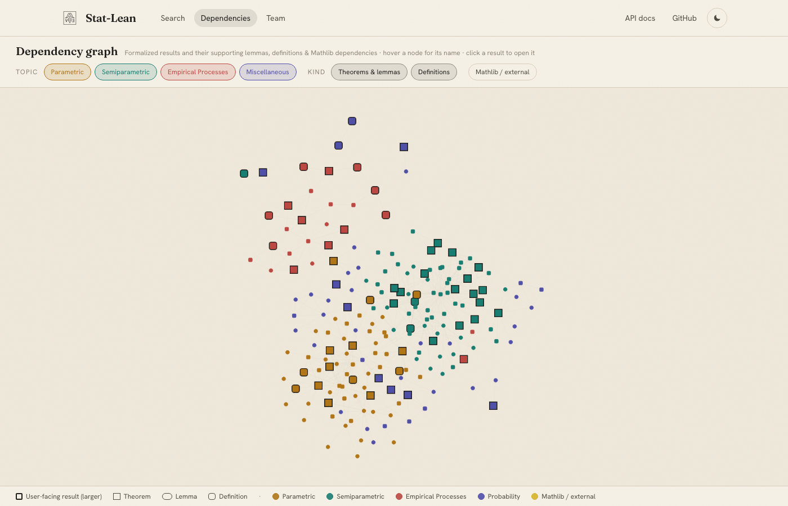

<div align="center">
  <br /><br />

  <h1>Asymptotic Statistical Theory in Lean 4</h1>


  <p>
    <a href="https://junwei-lu.github.io/Lean-Asymptotic-Statistical-Theory/website/">
      
    </a>
    <a href="https://junwei-lu.github.io/Lean-Asymptotic-Statistical-Theory/docs/">
      
    </a>
    <a href="LICENSE">
      
    </a>
  </p>
</div>

## Website

**[https://junwei-lu.github.io/Lean-Asymptotic-Statistical-Theory/website/](https://junwei-lu.github.io/Lean-Asymptotic-Statistical-Theory/website/)**

The interactive website lets you browse every formalized result and compare its
informal mathematical statement side-by-side with the Lean 4 proof signature.

<div align="center">
  
</div>

<br />

<table>
  <tr>
    <td width="50%">
      <strong>📐 Informal ↔ Lean side-by-side</strong><br />
      Natural-language statement with LaTeX math and textbook citation alongside the exact Lean <code>theorem</code> or <code>def</code> signature.
    </td>
    <td width="50%">
      <strong>🔦 Hypothesis cross-highlighting</strong><br />
      Hover any hypothesis in the Lean code to highlight the corresponding phrase in the informal statement, and vice versa.
    </td>
  </tr>
  <tr>
    <td>
      <strong>🕸️ Dependency graphs</strong><br />
      Every result has an interactive graph showing the chain of repository lemmas down to the first Mathlib boundary, color-coded by topic.
    </td>
    <td>
      <strong>📝 Note on Informalization</strong><br />
      Each result includes a formalization note explaining design choices, typeclass decisions, and how the Lean encoding relates to the textbook statement. Links to the <a href="https://junwei-lu.github.io/Lean-Asymptotic-Statistical-Theory/docs/">doc-gen4 API reference</a> for every result.
    </td>
  </tr>
</table>

<div align="center">
  
  <br /><sub><em>Informal statement (left) aligned with Lean signature (right) — hover a hypothesis to cross-highlight.</em></sub>
</div>

<br />

<div align="center">
  
  <br /><sub><em>Global dependency graph — color-coded by topic, click any node to open the result.</em></sub>
</div>

---

## Installation Guide

### 1. Install Lean via [`elan`](https://leanprover-community.github.io/get_started.html)

`elan` manages Lean versions and reads the `lean-toolchain` file to pin the exact version used here.

**macOS / Linux / WSL:**

```bash
curl https://raw.githubusercontent.com/leanprover/elan/master/elan-init.sh -sSf | sh -s -- -y
source $HOME/.elan/env   # add to ~/.zshrc or ~/.bashrc
```

**Windows (PowerShell):**

```powershell
curl -L https://github.com/leanprover/elan/releases/latest/download/elan-init.ps1 -o elan-init.ps1
.\elan-init.ps1
```

Verify:

```bash
elan --version
lean --version    # may say "no toolchain" until step 3 — that is fine
lake --version
```

### 2. Clone

```bash
git clone https://github.com/junwei-lu/Lean-Asymptotic-Statistical-Theory.git
cd Lean-Asymptotic-Statistical-Theory
```

### 3. Fetch the Mathlib build cache

```bash
lake exe cache get
```

Mathlib is large; this downloads a precompiled cache in minutes instead of building from scratch.

### 4. Build

```bash
lake build
```

### 5. Use as a dependency

Add to your `lakefile.lean`:

```lean
require AsymptoticStatistics from git
  "https://github.com/junwei-lu/Lean-Asymptotic-Statistical-Theory.git" @ "main"
```

then run `lake update && lake exe cache get && lake build`. Your project must use the same toolchain version as this repository's `lean-toolchain` file.

---

## Formalization Results

We formalize the following results from [van der Vaart (1998), *Asymptotic Statistics*](https://www.cambridge.org/core/books/asymptotic-statistics/A3C7DAD3F7E66A1FA60E9C8FE132EE1D).


### 🔷 Core Definitions

The concept layer that downstream theorems quantify over.

| Name | File | Reference |
|------|------|-----------|
| `DifferentiableQuadraticMean` | `DQM/Defs.lean` | vdV (1998), Eq (7.1) — Differentiability in Quadratic Mean |
| `QMDPath` | `Core/QMDPath.lean` | vdV (1998), §7.2 — quadratic-mean-differentiable path |
| `RegularEstimatorSequence` | `ParametricFamily/RegularEstimator.lean` | vdV (1998), §8.5 — regular estimator sequence |
| `IsRegularEstimator` / `IsRegularEstimator_vec` | `LowerBounds/RegularEstimator.lean`, `LowerBounds/RegularEstimatorVec.lean` | vdV (1998), §25.3 — regular estimator (semiparametric) |
| `BowlShaped` | `ForMathlib/BowlShaped.lean` | vdV (1998), §8.7 — bowl-shaped loss function |
| `TangentSpec` | `Core/TangentAbstract.lean` | vdV (1998), §25.3 — tangent set / tangent space |
| `IsGaussianShift` | `Experiment/GaussianShift.lean` | vdV (1998), §8.2 — Gaussian shift experiment |
| `IsEquivariantInLaw` | `Experiment/EquivariantInLaw.lean` | vdV (1998), §8.4 — equivariant-in-law estimator |
| `IsPGlivenkoCantelli` | `EmpiricalProcess/GlivenkoCantelli.lean` | vdV (1998), §19.1 — Glivenko–Cantelli class |
| `IsPDonsker` | `EmpiricalProcess/Donsker.lean` | vdV (1998), §19.2 — Donsker class |
| `IsBracket` / `IsEpsBracket` | `EmpiricalProcess/Bracketing.lean` | vdV (1998), §19.2 — ε-bracket |
| `HasFiniteBracketingCover` | `EmpiricalProcess/Bracketing.lean` | vdV (1998), §19.2 — bracketing number `N_[](ε, F, L_r)` |
| `IsEnvelope` | `EmpiricalProcess/FunctionClass.lean` | vdV (1998), §19.2 — envelope function |
| `IsCoarseningAtRandom` | `Operators/CAR.lean` | vdV (1998), §25.6 — coarsening at random |

### 📉 Local Asymptotic Normality

Quadratic-mean differentiability and the LAN expansion of the log-likelihood ratio.

| Name | File | Reference |
|------|------|-----------|
| `paramSubmodel_DQM` | `ParametricFamily/SubmodelDQM.lean` | vdV (1998), Eq (7.1) — parametric submodel is differentiable in quadratic mean |
| `LAN_expansion` | `LocalAsymptoticNormality/LANExpansion.lean` | vdV (1998), Thm 7.2 — local asymptotic normality of the log-likelihood via score and Fisher information |

### 📈 Parametric Efficiency

Contiguity, the Hájek–Le Cam convolution theorem, and the local asymptotic minimax lower bound.

| Name | File | Reference |
|------|------|-----------|
| `contiguous_local_alternatives` | `LocalAsymptoticNormality/AsymptoticRepresentation.lean` | vdV (1998), Thm 6.5 — mutual contiguity of local alternative sequences |
| `regularity_implies_8_2_hypothesis` | `Efficiency/HajekLeCamConvolution.lean` | vdV (1998), Thm 8.2 — regular estimators satisfy the convergence-of-experiments hypothesis |
| `LAN_representation_vdV` | `LocalAsymptoticNormality/AsymptoticRepresentation.lean` | vdV (1998), Thm 8.4 — asymptotic representation via a Gaussian-shift Markov kernel |
| `anderson_lemma_set` | `ForMathlib/Anderson.lean` | vdV (1998), Lem 8.5 — Anderson's lemma for Gaussian superlevel sets |
| `hajek_le_cam_convolution_theorem` | `Efficiency/HajekLeCamConvolution.lean` | vdV (1998), Thm 8.8 — regular estimator limit factors as a Gaussian convolution |
| `local_asymptotic_minimax_bound` | `Efficiency/LocalAsymptoticMinimax.lean` | vdV (1998), Thm 8.11 — local asymptotic minimax lower bound for the risk |

### 🔬 Empirical Processes

Glivenko–Cantelli and Donsker theorems via bracketing entropy, plus Bernstein and maximal inequalities.

| Name | File | Reference |
|------|------|-----------|
| `isPGlivenkoCantelli_of_finite_bracketing_L1` | `EmpiricalProcess/GlivenkoCantelli.lean` | vdV (1998), Thm 19.4 — finite L¹-bracketing implies the Glivenko–Cantelli property |
| `isPDonsker_of_finite_bracketing_entropy_integral` | `EmpiricalProcess/DonskerBracketing.lean` | vdV (1998), Thm 19.5 — finite bracketing entropy integral implies the Donsker property |
| `donsker_random_function_consistency` | `EmpiricalProcess/RandomFunctions.lean` | vdV (1998), Lem 19.24 — empirical process at a consistent random argument is negligible |
| `empiricalProcess_param_estimation` | `EmpiricalProcess/ParameterEstimation.lean` | vdV (1998), Thm 19.26 — empirical process convergence under estimated parameters |
| `bernstein_inequality` | `EmpiricalProcess/Maximal.lean` | vdV (1998), Lem 19.32 — Bernstein tail bound for empirical sums |
| `finite_sup_bound` | `EmpiricalProcess/Maximal.lean` | vdV (1998), Lem 19.33 — expected maximum over a finite function class |
| `maximal_inequality_bracketing` | `EmpiricalProcess/Maximal.lean` | vdV (1998), Lem 19.34 — bracketing maximal inequality for the empirical process |

### 🧮 Semiparametric Models and Efficiency

Efficient influence functions, score operators, convolution theorem, and one-step / Z-estimator efficiency.

| Name | File | Reference |
|------|------|-----------|
| `score_in_L2ZeroMean` | `Core/QMDPath.lean` | vdV (1998), Lem 25.14 — score is mean-zero and square-integrable |
| `eif_eq_orthogonalProjection` | `Core/EIF.lean` | vdV (1998), Thm 25.18 — efficient influence function is the projection onto the tangent space |
| `efficient_bound_eq_sup_ratio` | `Core/EIF.lean` | vdV (1998), Lem 25.19 — efficiency bound as a supremum of inner-product ratios |
| `semiparametric_convolution_theorem` | `LowerBounds/Convolution.lean` | vdV (1998), Thm 25.20 — convolution theorem and asymptotic variance lower bound |
| `semiparametric_convolution_theorem_vec` | `LowerBounds/ConvolutionVec.lean` | vdV (1998), Thm 25.20 — vector convolution theorem and covariance lower bound |
| `semiparametric_local_asymptotic_minimax_theorem` | `LowerBounds/LAM.lean` | vdV (1998), Thm 25.21 — semiparametric local asymptotic minimax bound |
| `semiparametric_local_asymptotic_minimax_theorem_real` | `LowerBounds/LAM.lean` | vdV (1998), Thm 25.21 — scalar semiparametric local asymptotic minimax corollary |
| `estimator_semiparametricallyEfficient_of_asympLinear_eif` | `Core/EfficiencyOperational.lean` | vdV (1998), Eq (25.22) — asymptotically linear estimator with the EIF is efficient |
| `eif_from_efficientScore` | `StrictModel/EfficientScore.lean` | vdV (1998), Lem 25.25 — efficient influence function from the efficient score |
| `eif_via_information_operator` | `Operators/ScoreOperator.lean` | vdV (1998), Eq (25.30) — efficient influence function via the information operator |
| `eif_via_adjoint_equation` | `Operators/ScoreOperator.lean` | vdV (1998), Thm 25.31 — efficient influence function via the adjoint score equation |
| `efficientScore_projection_formula` | `Operators/ScoreOperator.lean` | vdV (1998), Eq (25.33) — efficient score as score minus its nuisance projection |
| `influence_on_sup_of_subtract_proj_nuisance` | `Core/EIF.lean` | vdV (1998), Cor 25.42 — influence function by subtracting the nuisance projection |
| `zEstimator_semiparametricallyEfficient` | `Asymptotics/ZEstimator.lean` | vdV (1998), Thm 25.54 — efficient-score Z-estimator is semiparametrically efficient |
| `oneStep_semiparametricallyEfficient` | `Asymptotics/OneStep.lean` | vdV (1998), Thm 25.57 — one-step corrected estimator is semiparametrically efficient |
| `zEstimator_biasResidual_expansion` | `Asymptotics/ZEstimator.lean` | vdV (1998), Thm 25.59 — Z-estimator expansion with explicit bias–residual term |
| `mle_semiparametricallyEfficient` | `Asymptotics/LeastFavorable.lean` | vdV (1998), Thm 25.77 — least-favorable-path MLE is semiparametrically efficient |

### 🧱 Supporting Probability and Analysis Results

Standard results used as load-bearing infrastructure: Prékopa–Leindler, Anderson's lemma, Le Cam lemmas, multivariate CLT, and Doob L² isometries.

| Name | File | Reference |
|------|------|-----------|
| `prekopaLeindler` | `ForMathlib/PrekopaLeindler.lean` | Prékopa–Leindler inequality on ℝⁿ [\[Prékopa 1973\]](#ref-prekopa1973) |
| `anderson_lemma_independent` | `ForMathlib/Anderson.lean` | Anderson's lemma, independent coordinates [\[Anderson 1955\]](#ref-anderson1955) |
| `mutuallyContiguous_of_asymptotically_log_normal` | `ForMathlib/Contiguity.lean` | Le Cam's first lemma (mutual contiguity from asymptotic log-normality) [\[vdV 1998, §6.4\]](#ref-vdv1998) |
| `weak_limit_under_Q_of_lecam_third` | `ForMathlib/Contiguity.lean` | Le Cam's third lemma (weak limit transport under contiguity) [\[vdV 1998, §6.7\]](#ref-vdv1998) |
| `levyMpass_vec` | `ForMathlib/LevyMpassVec.lean` | Lévy continuity theorem for vector-valued laws [\[Lévy 1925\]](#ref-levy1925) |
| `tendstoInDistribution_multivariate_clt` | `ForMathlib/MultivariateCLT.lean` | Multivariate CLT via characteristic functions [\[Cramér–Wold 1936\]](#ref-cramerwold1936) |
| `cramerWold_weakConverges` | `ForMathlib/CramerWoldWeakConverges.lean` | Cramér–Wold device for weak convergence [\[Cramér–Wold 1936\]](#ref-cramerwold1936) |
| `WeakConverges.slutsky_of_tendstoInMeasure_dist` | `ForMathlib/Slutsky.lean` | Slutsky's theorem [\[Slutsky 1925\]](#ref-slutsky1925) |
| `doobL2Equiv` | `ForMathlib/CondExpL2.lean` | Doob L² isometry: conditional expectation as L²(σ-sub-algebra) ≃ L²(comap) [\[Doob 1953\]](#ref-doob1953) |
| `lpTrimComapToLpMap` | `ForMathlib/CondExpL2.lean` | Doob-style identification Lᵖ(μ\|_𝒢) ≃ Lᵖ(map μ) [\[Doob 1953\]](#ref-doob1953) |

---

## References

<a id="ref-vdv1998"></a>
- **[vdV 1998]** van der Vaart, A. W. (1998). *Asymptotic Statistics*.
  Cambridge Series in Statistical and Probabilistic Mathematics, Vol. 3.
  Cambridge University Press.

<a id="ref-anderson1955"></a>
- **[Anderson 1955]** Anderson, T. W. (1955). The integral of a symmetric
  unimodal function over a symmetric convex set and some probability
  inequalities. *Proceedings of the American Mathematical Society*, 6(2),
  170–176.

<a id="ref-prekopa1973"></a>
- **[Prékopa 1973]** Prékopa, A. (1973). On logarithmic concave measures and
  functions. *Acta Scientiarum Mathematicarum*, 34, 335–343.

<a id="ref-lecam1972"></a>
- **[Le Cam 1972]** Le Cam, L. (1972). Limits of experiments. In *Proceedings
  of the Sixth Berkeley Symposium on Mathematical Statistics and Probability*,
  Vol. 1, 245–261.

<a id="ref-hajek1970"></a>
- **[Hájek 1970]** Hájek, J. (1970). A characterization of limiting
  distributions of regular estimates. *Zeitschrift für
  Wahrscheinlichkeitstheorie und Verwandte Gebiete*, 14, 323–330.

<a id="ref-levy1925"></a>
- **[Lévy 1925]** Lévy, P. (1925). *Calcul des Probabilités*.
  Gauthier-Villars, Paris.

<a id="ref-cramerwold1936"></a>
- **[Cramér–Wold 1936]** Cramér, H., and Wold, H. (1936). Some theorems on
  distribution functions. *Journal of the London Mathematical Society*, 11(4),
  290–294.

<a id="ref-slutsky1925"></a>
- **[Slutsky 1925]** Slutsky, E. (1925). Über stochastische Asymptoten und
  Grenzwerte. *Metron*, 5(3), 3–89.

<a id="ref-doob1953"></a>
- **[Doob 1953]** Doob, J. L. (1953). *Stochastic Processes*. Wiley.
